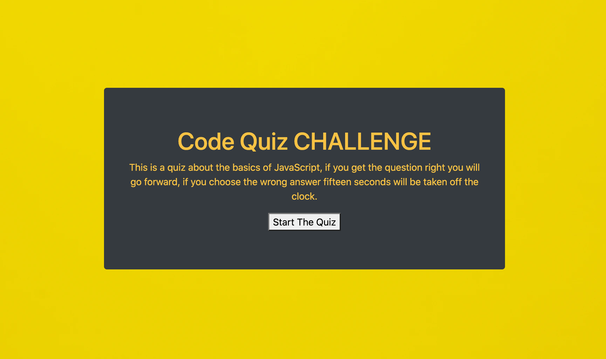

<strong>The Code Quiz</strong>

The code quiz in this repository is a javascript quiz meant to test the user on their javascript skills. This is something that users of the quiz may find when they are going through the hiring process. This quiz is set in true/false based off of my personal belief that going through school I always struggled with true and false questions over multiple choice. Essentially there is a 50% chance of getting it wrong and that was always daunting to me.

Throughout the process of making the code quiz I really had to hone in on my javascript skills especially with for loops and functions. This was good practice for me because I really didn't feel that comfortable in the previous homework with functions. 

You will note unfortunately that the scores panel does not save the scores to the screen as I did run out of time, but the local storage is storing all of the scores. In the future I hope to complete those lines of code to have a better product.

I would like to thank my Tutors and fellow students as we all logged many hours on this assignment.

Live page: https://meusjoseph21.github.io/code-quiz-hw04/

github repo: https://github.com/meusjoseph21/code-quiz-hw04

